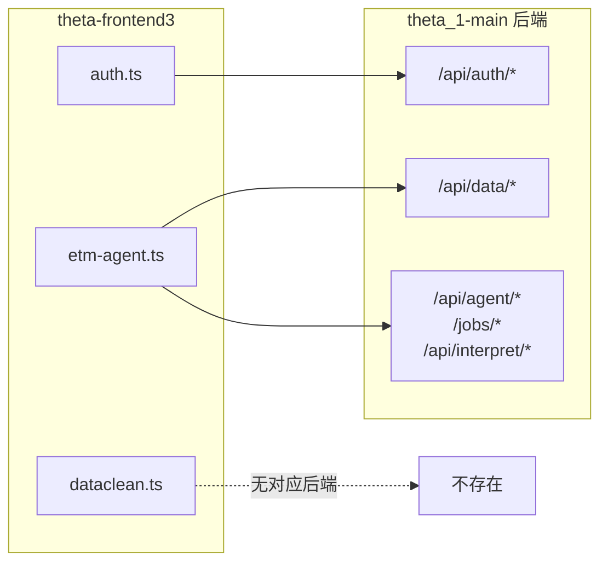

# 前后端全面对齐与清理计划

## 当前状态

后端 (theta_1-main) 提供两个服务：

- **主 API** (`api/main.py`, port 8000): 认证、OSS 上传、DLC 训练任务
- **Agent API** (`agent/api.py`, 独立服务): AI 对话、结果解读、图表分析




## 一、API 接口不匹配修复

### 1. 认证接口 — [lib/api/auth.ts](theta-frontend3/lib/api/auth.ts)


| 问题                                                                                              | 修复方案                                       |
| ----------------------------------------------------------------------------------------------- | ------------------------------------------ |
| `login()` 先尝试 `/api/auth/login-json`（不存在），再 fallback                                            | 直接调用 `/api/auth/login`                     |
| `getCurrentUser()` 期望 `{id, email, full_name, is_active}` 但后端只返回 `{username, role, expires_at}` | 归一化映射：`id=0, email="", full_name=username` |
| `register()` 调用 `/api/auth/register`（后端不支持）                                                     | 删除方法或改为 throw "暂不支持注册"                     |


### 2. ETM Agent API — [lib/api/etm-agent.ts](theta-frontend3/lib/api/etm-agent.ts)

后端**不存在**以下端点，前端调用它们会 404 然后静默失败或报错：

- `/api/datasets`, `/api/datasets/{name}` (DELETE)
- `/api/tasks`, `/api/tasks/{id}`, `/api/tasks/stats`, `/api/tasks/{id}/logs`
- `/api/results`, `/api/results/{dataset}/{mode}/`* (全部)
- `/api/preprocessing/`* (全部)
- `/api/scripts/`* (全部)
- `/api/chat/history/*`, `/api/chat/suggestions`

**修复方案**: 已有 try/catch fallback 的方法保留（`getTasks`, `getDatasets` 等已正确 fallback 到 `/api/data/jobs`）。其余无对应后端的方法统一改为返回空数据/默认值，避免控制台报错。清理掉 `runTraining/runEmbedding/runEvaluate/runVisualize/runFullPipeline` 等死方法。

### 3. WebSocket — [hooks/use-etm-websocket.ts](theta-frontend3/hooks/use-etm-websocket.ts)

后端没有 WebSocket 端点。当前 hook 连接失败后会不断重连。**修复**: 改为纯轮询模式或移除 hook，使用 `pollTaskUntilDone` 替代。

### 4. DataClean API — [lib/api/dataclean.ts](theta-frontend3/lib/api/dataclean.ts)

独立的 dataclean 服务 (port 8001) 不在 theta_1-main 中。仅被 `data-processing.tsx` 引用（该组件本身也没有被任何页面使用）。**修复**: 保留文件但不做任何更改（不影响运行），后续按需集成。

## 二、删除无用页面


| 页面                                                                                             | 原因                                              | 处理                         |
| ---------------------------------------------------------------------------------------------- | ----------------------------------------------- | -------------------------- |
| `/login` ([app/login/page.tsx](theta-frontend3/app/login/page.tsx))                            | 主页已有登录弹窗，此独立页面是旧版遗留                             | 删除，添加 redirect 到 `/`       |
| `/register` ([app/register/page.tsx](theta-frontend3/app/register/page.tsx))                   | 后端不支持注册                                         | 删除，添加 redirect 到 `/`       |
| `/results` ([app/results/page.tsx](theta-frontend3/app/results/page.tsx))                      | 使用旧版 `WorkspaceLayout`，调用不存在的 `/api/results` 端点 | 删除，redirect 到 `/dashboard` |
| `/visualizations` ([app/visualizations/page.tsx](theta-frontend3/app/visualizations/page.tsx)) | 同上，功能已在 dashboard 的项目工作台中集成                     | 删除，redirect 到 `/dashboard` |


## 三、删除无用组件


| 文件                                | 原因                                        |
| --------------------------------- | ----------------------------------------- |
| `components/workspace-layout.tsx` | 旧版 UI 外壳，仅被已删除的 results/visualizations 使用 |
| `components/theta-dashboard.tsx`  | 旧版仪表盘，无任何引用                               |
| `components/data-processing.tsx`  | 依赖 dataclean API，无任何引用                    |


## 四、导航清理

### app-shell.tsx — 内部工作台导航

- 移除 "结果" 按钮 (`/results` 链接)
- 移除 "可视化" 按钮 (`/visualizations` 链接)
- 这些功能已整合在 dashboard 的项目标签页中

### page.tsx — 主页

- Footer 中的 "安全白皮书" 链接保留（`/security` 页面是纯静态内容，有意义）
- Footer 中 "API 文档" 改为指向 `https://codesoul-co.github.io/THETA`

### auth-context.tsx — 登出重定向

- `logout()` 当前 `router.push('/login')` 改为 `router.push('/')`（login 页面将被删除）

## 五、Redirect 配置

在 [next.config.mjs](theta-frontend3/next.config.mjs) 中统一配置 redirect（已有 `/training` 的重定向）：

```javascript
async redirects() {
  return [
    { source: '/training', destination: '/dashboard', permanent: true },
    { source: '/login', destination: '/', permanent: true },
    { source: '/register', destination: '/', permanent: true },
    { source: '/results', destination: '/dashboard', permanent: true },
    { source: '/visualizations', destination: '/dashboard', permanent: true },
  ]
}
```

## 六、构建验证

修改完成后执行 `pnpm build` 确保无编译错误。