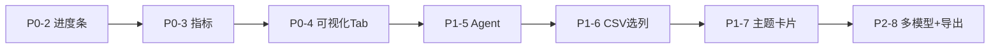

# THETA 前端修改清单实施计划

按优先级逐项完成：P0(2-4) → P1(5-7) → P2(8-9)。

---

## P0-2：进度条步骤独立计算

**问题**：总进度由 `15 + task.progress * 0.85` 计算，training 50% 时整体进度偏高，可能误判完成。

**方案**：每步骤根据自身日志独立更新，只在本步骤完成信号出现后打勾。

**实现**：

1. **并行轮询日志**：在 [auto-pipeline.tsx](theta-frontend3/components/project/auto-pipeline.tsx) 的 `pollTaskStatus` 中，同时调用 `ETMAgentAPI.getTaskLogs(taskId)` 获取 `logs`。
2. **日志 → 步骤映射**：解析 `logs[].message` 和 `logs[].step`，建立映射：
  - `step === "preprocess"` 且含百分比 → 数据预处理
  - `step === "embedding"` 或 preprocessing 相关 → 参数选择/嵌入
  - `step === "training"` 或含 "Epoch" → 模型训练（从 message 提取进度）
  - `step === "evaluation"` → 模型评估
  - `step === "visualization"` → 生成可视化
3. **进度计算**：每步只根据自身日志计算：
  - training：从 "Epoch X/Y" 提取 `X/Y * 100`
  - 其它步骤：出现 `status === "completed"` 即 100%
4. **完成判定**：步骤仅在本步骤的 `completed` 日志出现后打勾；跳转结果页仍以 `task.status === "completed"` 为准。

---

## P0-3：结果页 7 个指标动态渲染

**问题**：当前只渲染少量指标，`metrics_k{K}.json` 中多个指标未展示。

**方案**：读取完整指标并动态渲染，附上方向说明和 tooltip。

**实现**：

1. **数据源**：[ProjectResultView](theta-frontend3/app/dashboard/page.tsx) 中，`getMetrics` 返回的 `MetricsResponse` 含 `additional` 字段（完整 `metrics_*.json`）。优先使用 `additional`，若无则合并 `topic_coherence_avg`、`topic_diversity_td` 等顶层字段。
2. **指标与方向映射**（[dashboard/page.tsx](theta-frontend3/app/dashboard/page.tsx) 中新增常量）：
  - `TOPIC_DIVERSITY_TD`、`TOPIC_DIVERSITY_IRBO`、`TOPIC_COHERENCE_NPMI`、`TOPIC_COHERENCE_CVC_V`、`TOPIC_COHERENCE_AVG`、`TOPIC_EXCLUSIVITY` → ↑
  - `TOPIC_COHERENCE_UMASS` → 越接近 0 越好
  - `PPL`、`perplexity` → ↓
3. **UI**：指标卡片遍历 `Object.entries(metrics)` 动态渲染，右上角用 `Tooltip` + `Info` 显示名称与方向，不硬编码字段名。

---

## P0-4：结果页添加可视化 Tab

**问题**：后端生成的可视化未在前端展示。

**方案**：新增「可视化」Tab，按文件名分组懒加载。

**实现**：

1. **API**：在 [etm-agent.ts](theta-frontend3/lib/api/etm-agent.ts) 增加 `listVisualizations(dataset, mode)`，请求 `GET /api/results/{dataset}/{mode}/visualizations`。
2. **分组映射**：在 [dashboard/page.tsx](theta-frontend3/app/dashboard/page.tsx) 或新建 `components/results/visualization-tab.tsx` 中，按 docx 表建立 `filename → { displayName, group }` 映射（如 `topic_table.png` → 全局概览，`topic_network.png` → 全局概览 等）。
3. **Tabs 结构**：`ProjectResultView` 增加 Tabs：「指标」和「可视化」。切换到「可视化」 Tab 时再请求 `listVisualizations`（懒加载）。
4. **渲染**：图片用 ``，`.html` 用 `<iframe height="600" src={url} />`。图片 URL：`/api/results/{dataset}/{mode}/visualizations/{filename}` 或通过 `API_BASE` 拼完整路径。

---

## P1-5：Agent 图表引用（分 4 子项）

### 5.1 Agent cite 图表

- **后端**：在 `/api/agent/chat` 及 stream 返回中增加 `citations: [{ ref, type, url, caption, analysis? }]`。
- **前端**：在 [ai-sidebar.tsx](theta-frontend3/components/chat/ai-sidebar.tsx) 的 `MessageBubble` 中，将正文里的 `[图1]` 等渲染为可点击角标，下方渲染引用卡片（缩略图 + 标题 + analysis），支持折叠、点击全屏。

### 5.2 用户引用图表给 Agent

- **拖拽**：可视化 Tab 的图片支持 `draggable`，输入框支持 `onDrop`，将图片 URL 作为 `attachments` 随消息发送。
- **@ 引用**：输入 `@` 弹出选择器，调用 `listVisualizations` 列出图表，选择后插入引用，发送时附带 `attachments`。
- **后端**：`/api/agent/chat` 支持 `attachments`，并调用 vision API 分析图表。

### 5.3 流式输出

- 已有 `chatStream`，确认 [dashboard/page.tsx](theta-frontend3/app/dashboard/page.tsx) 的 `handleSendMessage` 已使用并正确处理 `tool_start`、`tool_end`、`done` 等事件，流式显示内容并渲染 `citations`。

### 5.4 动态智能建议

- 训练完成后，调用 `interpretMetrics`、`interpretTopics`、`generateSummary`（需 `job_id`，可用 `task_id` 或 `dataset` 映射）。
- 将静态建议替换为上述返回生成的「指标解读」「主题解读」「分析报告」卡片。

---

## P1-6：CSV 上传先选列和清洗

**依赖**：后端需提供预览接口（`--preview`）和清洗脚本 `02_clean_data.sh` 的 API。

**实现**：

1. **预览**：上传后调用预览接口，返回列名与前 5 行样本。
2. **列选择**：用户选择「文本列」（必选）和「标签/元数据列」（可选）。
3. **清洗选项**：开关：删除 URL、HTML、标点、停用词、特殊字符、规范化空白；输入：最小词数（默认 3）。
4. **执行清洗**：调用清洗 API（封装 `02_clean_data.sh`），完成后再进入配置面板。

**注意**：若当前 backend 无预览与清洗接口，需先在 langgraph_agent 中补充对应路由。

---

## P1-7：主题卡片增强

**实现**：

1. **权重**：`topic_words` 若为 `{ topic_0: [[word, weight], ...] }` 格式，词标签悬停显示 weight。
2. **占比**：从 `theta.npy` 或 `topic_words` 的 `prevalence` 读取文档占比，展示在卡片顶部。
3. **展开**：点击卡片展开，加载 `topics/topic_N/word_importance.png`。需后端提供按 topic 获取图表的 API，或根据已有 visualization 列表匹配路径。

**数据**：确认 [get_topic_words](langgraph_agent/backend/app/api/routes.py) 和 topic_words JSON 是否包含 `(word, weight)` 及 `prevalence`；若无，需在 nodes 或路由中扩展返回结构。

---

## P2-8：多模型对比 + 结果导出

### 多模型对比

- 配置面板已支持多选模型；需确保 `createTask` 传 `models: "lda,hdp,..."` 且后端支持。
- 训练完成后调用 `08_compare_models.sh` 对应 API；若不存在，需在 backend 增加。
- 结果页新增「模型对比」Tab，展示跨模型 7 指标对比表，最优列高亮，支持按列排序。

### 结果导出

- 结果页右上角增加「导出」按钮，弹出勾选：评估指标、主题词、所有图表 ZIP、模型对比报告等。
- 每类对应后端文件或打包 API，若无则需 backend 提供下载端点。

---

## 实施顺序建议

**第一批（P0）**：P0-2、P0-3、P0-4，仅前端改动，可立即实施。
**第二批（P1）**：P1-5 前端为主，P1-6、P1-7 需确认后端接口。
**第三批（P2）**：P2-8 依赖 `08_compare_models` 等 backend API。

---

## 关键文件索引

| 任务   | 主要修改文件                                                                                                                                                 |
| ---- | ------------------------------------------------------------------------------------------------------------------------------------------------------ |
| P0-2 | [auto-pipeline.tsx](theta-frontend3/components/project/auto-pipeline.tsx)                                                                              |
| P0-3 | [dashboard/page.tsx](theta-frontend3/app/dashboard/page.tsx)（ProjectResultView）                                                                        |
| P0-4 | [etm-agent.ts](theta-frontend3/lib/api/etm-agent.ts)、[dashboard/page.tsx](theta-frontend3/app/dashboard/page.tsx)                                      |
| P1-5 | [ai-sidebar.tsx](theta-frontend3/components/chat/ai-sidebar.tsx)、[dashboard/page.tsx](theta-frontend3/app/dashboard/page.tsx)                          |
| P1-6 | [auto-pipeline.tsx](theta-frontend3/components/project/auto-pipeline.tsx)、新建列选择/清洗组件                                                                   |
| P1-7 | [dashboard/page.tsx](theta-frontend3/app/dashboard/page.tsx)（主题卡片部分）                                                                                   |
| P2-8 | [analysis-config-panel.tsx](theta-frontend3/components/project/analysis-config-panel.tsx)、[dashboard/page.tsx](theta-frontend3/app/dashboard/page.tsx) |

