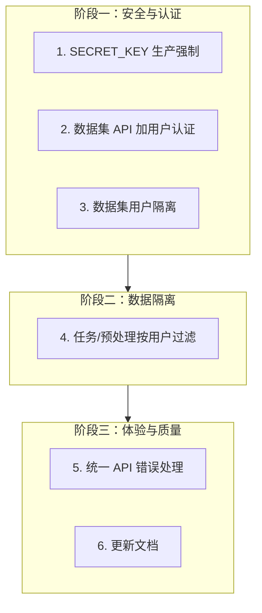

# THETA 项目问题逐项修复计划

## 修复顺序总览

---

## 阶段一：安全与认证

### 1. SECRET_KEY 生产环境强制配置

**问题**：[config.py](langgraph_agent/backend/app/core/config.py) 中 `SECRET_KEY` 有默认值，生产环境不安全。

**修改**：

- 在 `Settings` 中增加 `ENV` 或 `PRODUCTION` 判断（可通过 `DEBUG=false` 或新增 `ENV=production`）
- 当 `DEBUG=false` 且 `SECRET_KEY` 仍为默认值时，启动时 `raise ValueError("SECRET_KEY must be set in production")`
- 或更简单：移除默认值，改为 `default=""`，在 `main.py` lifespan 中检查：若 `not settings.SECRET_KEY and not settings.DEBUG` 则退出

**验证**：

- 未设置 `SECRET_KEY` 且 `DEBUG=false` 时，后端启动失败
- 设置 `SECRET_KEY` 后正常启动
- 本地开发 `DEBUG=true` 时仍可使用默认 key

---

### 2. 数据集 API 添加用户认证

**问题**：`/api/datasets`、`/api/datasets/upload`、`/api/datasets/{name}`（GET/DELETE）均未要求登录。

**修改**：[routes.py](langgraph_agent/backend/app/api/routes.py)

- `list_datasets`：添加 `current_user: User = Depends(get_current_active_user)`，可选：未登录时返回 401 或空列表（建议 401 保持一致性）
- `upload_dataset`：添加 `Depends(get_current_active_user)`
- `delete_dataset`：添加 `Depends(get_current_active_user)`
- `get_dataset_info`：添加 `Depends(get_current_active_user)`

**验证**：

- 未带 Token 调用上述接口返回 401
- 带有效 Token 可正常 list/upload/delete/get

---

### 3. 数据集用户隔离（多用户数据隔离）

**问题**：数据集存储在 `DATA_DIR/{dataset_name}/`，无用户归属，任何登录用户可访问/删除他人数据。

**方案**：新增 `user_dataset` 表记录归属，列表/删除时按 `user_id` 过滤。

**修改**：

1. 新增模型 [langgraph_agent/backend/app/models/user_dataset.py](langgraph_agent/backend/app/models/user_dataset.py)：
  - `user_id`, `dataset_name`, `created_at`
  - 唯一约束 `(user_id, dataset_name)`
2. 在 [database.py](langgraph_agent/backend/app/core/database.py) 的 `init_db` 中导入 `user_dataset`
3. 修改 [routes.py](langgraph_agent/backend/app/api/routes.py)：
  - `upload_dataset`：写入文件后，插入 `UserDataset(user_id=current_user.id, dataset_name=safe_name)`
  - `list_datasets`：从 `UserDataset` 按 `user_id` 查询 `dataset_name` 列表，仅对这些目录做 filesystem 扫描
  - `delete_dataset`：先查 `UserDataset` 确认 `user_id` 匹配再删除目录和记录
  - `get_dataset_info`：同上，先校验归属
4. 迁移脚本（可选）：为 `DATA_DIR` 下已有目录创建 `UserDataset(user_id=1, dataset_name=...)`，便于过渡

**验证**：

- 用户 A 上传数据集 `ds1`，用户 B 的 list 中看不到 `ds1`
- 用户 B 调用 `DELETE /datasets/ds1` 返回 403 或 404
- 用户 A 可正常删除自己的 `ds1`

---

## 阶段二：数据隔离

### 4. 任务与预处理按用户过滤

**问题**：`/api/tasks`、`/api/preprocessing` 等可能返回或操作其他用户的任务。

**修改**：

- 检查 [task_store](langgraph_agent/backend/app/services/task_store.py) 和 [routes.py](langgraph_agent/backend/app/api/routes.py) 中任务相关接口
- 若 `Task` 模型有 `user_id`：list/get/delete 时按 `user_id` 过滤
- 若当前为内存/文件存储无 `user_id`：在创建任务时写入 `user_id`，查询时过滤
- 预处理接口同理，按 `user_id` 过滤

**验证**：

- 用户 A 创建任务，用户 B 的 `GET /tasks` 中看不到该任务
- 用户 B 无法通过 `GET /tasks/{id}` 访问用户 A 的任务

---

## 阶段三：体验与质量

### 5. 统一 API 错误处理（前端）

**问题**：部分 API 调用缺少 try/catch，错误提示不友好。

**修改**：[theta-frontend3/lib/api/etm-agent.ts](theta-frontend3/lib/api/etm-agent.ts) 及 `fetchApi` 封装

- 在 `fetchApi` 或请求封装层统一处理 401（跳转登录/刷新 token）、5xx（提示服务异常）
- 对关键流程（上传、创建任务、创建项目）补充 `try/catch` 和用户可见的 toast/alert

**验证**：

- 断网或 500 时，前端有明确错误提示
- 401 时能正确跳转或提示重新登录

---

### 6. 更新《前后端完成与对接情况》文档

**问题**：文档仍描述已删除的 `/login`、`/register` 独立页面，与当前实现不一致。

**修改**：[前后端完成与对接情况.md](前后端完成与对接情况.md)

- 更新「已实现页面」：移除 /login、/register 独立页面，注明登录/注册通过首页弹窗
- 更新「Redirect 配置」：与 [next.config.mjs](theta-frontend3/next.config.mjs) 中的 redirects 一致
- 补充数据集、项目等接口的用户认证说明（完成阶段一、二后）

**验证**：文档与当前代码行为一致

---

## 每项修复后的测试清单

| 步骤  | 操作                                            |
| --- | --------------------------------------------- |
| 1   | 修改代码                                          |
| 2   | 运行 `pnpm build`（前端）或 `python -m pytest`（若有测试） |
| 3   | 启动后端 + 前端，按「验证」项做手工测试                         |
| 4   | 确认无回归（登录、上传、训练、结果查看等主流程正常）                    |

---

## 暂不纳入本计划的事项

- 多套前端代码清理（`THETA_FULL_CODE`、`起始界面`、`项目主界面`）——需先确认各目录用途
- 关闭 `ignoreBuildErrors` 并修复 TypeScript 错误——工作量大，单独排期
- 单元测试/E2E 测试——单独排期
- DTM 模型 TODO——属于功能完善，非修复范畴

